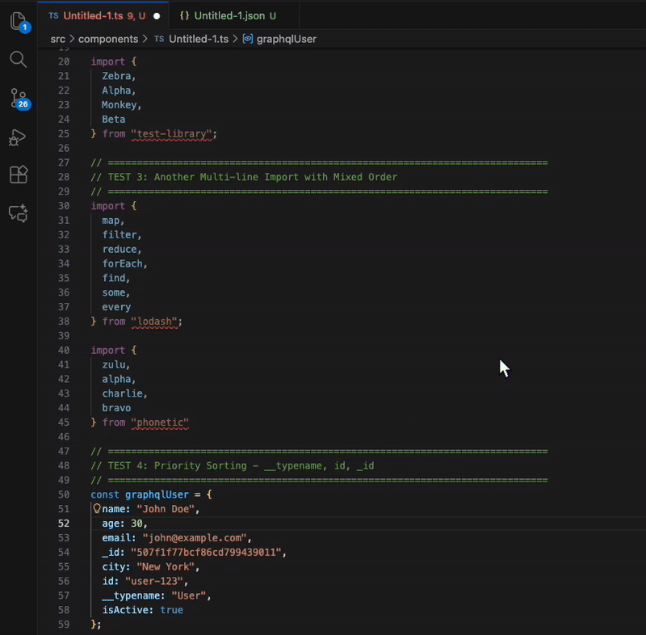

# Object Sort Alphabetical

**The most intelligent object sorting extension for VS Code. Automatically sorts objects, interfaces, types, imports, and destructuring patterns alphabetically on save - with perfect formatting preservation and smart prioritization for GraphQL.**



> 🏆 **What makes this special?** Unlike other formatters, we use the "apartment building" approach - we identify the structure (commas, newlines, spaces) and only swap the content, preserving your exact formatting. No opinionated formatting, no conflicts with your linter.

## ✨ Features

### 🎯 Smart Sorting
- **Priority sorting** - `__typename`, `id`, and `_id` always come first (perfect for GraphQL)
- **Nested objects** - Recursively sorts all nested objects, no matter how deep
- **Context-aware** - Knows the difference between object literals, destructuring, and function params

### 🔧 What Gets Sorted
- ✅ Object literals (`const obj = { ... }`)
- ✅ TypeScript interfaces and types (with semicolons!)
- ✅ Named imports (`import { ... }`)
- ✅ Object destructuring (`const { a, b } = obj`)
- ✅ Objects inside arrays (array order preserved!)
- ✅ Shorthand properties
- ✅ String keys with special characters

### 🎨 Perfect Formatting Preservation
- **Zero formatting changes** - Your spaces, newlines, commas, and semicolons stay exactly as you wrote them
- **No linter conflicts** - We don't reformat, we just reorder
- **Handles complex types** - `Record<string, string>`, `Array<Type>`, generics, arrow functions, multiline values

### 🛡️ Smart Protection
- **Arrays never sorted** - Order matters for execution and data structure
- **Array destructuring preserved** - `const [a, b] = arr` stays positional
- **Function params preserved** - Positional arguments stay in order
- **Class bodies untouched** - Structure and syntax preserved
- **Ignore comments** - Skip sorting with `// auto-sort-ignore` or `// auto-sort-ignore-next-line`

## Installation

1. Install from the VS Code Marketplace (search for "Object Sort Alphabetical")
2. Or install via command line:
   ```bash
   code --install-extension object-sort-alphabetical
   ```
3. Alternatively, clone from [GitHub](https://github.com/ozJSey/object-key-sort-alphabetical) and build locally:
   ```bash
   git clone https://github.com/ozJSey/object-key-sort-alphabetical.git
   cd object-key-sort-alphabetical
   npm install
   npm run compile
   ```

## Usage

Just save your file! The extension automatically sorts:

### Objects

**Before:**
```javascript
const user = {
  name: "John",
  age: 30,
  _id: "mongo-id",
  id: "user-123",
  __typename: "User"
};
```

**After:**
```javascript
const user = {
  __typename: "User",
  id: "user-123",
  _id: "mongo-id",
  age: 30,
  name: "John"
};
```

### TypeScript Interfaces

**Before:**
```typescript
interface User {
  name: string;
  age: number;
  id: string;
  __typename: string;
}
```

**After:**
```typescript
interface User {
  __typename: string;
  id: string;
  age: number;
  name: string;
}
```

### Imports

**Before:**
```typescript
import { useState, useEffect, useMemo, useCallback, useRef } from "react";
```

**After:**
```typescript
import { useCallback, useEffect, useMemo, useRef, useState } from "react";
```

### Object Destructuring

**Before:**
```javascript
const { zebra, alpha, monkey } = { alpha: 2, monkey: 3, zebra: 1 };
```

**After:**
```javascript
const { alpha, monkey, zebra } = { alpha: 2, monkey: 3, zebra: 1 };
```

Both sides are sorted! Perfect for maintaining consistency.

### Complex TypeScript Types

**Before:**
```typescript
type ApiConfig = {
  timeout: number;
  retries: number;
  baseUrl: string;
  headers: Record<string, string>;
  enabled: boolean;
};
```

**After:**
```typescript
type ApiConfig = {
  baseUrl: string;
  enabled: boolean;
  headers: Record<string, string>;
  retries: number;
  timeout: number;
};
```

Handles generics, nested types, and complex type annotations perfectly!

### Nested Objects

**Before:**
```javascript
const data = {
  user: {
    name: "Bob",
    id: "123",
    profile: {
      bio: "Developer",
      avatar: "pic.jpg"
    }
  }
};
```

**After:**
```javascript
const data = {
  user: {
    id: "123",
    name: "Bob",
    profile: {
      avatar: "pic.jpg",
      bio: "Developer"
    }
  }
};
```

## Priority Sorting

Special keys are always sorted first in this order:

1. **`__*` keys** (like `__typename`) - Always first
2. **`id`** - Always second
3. **`_id`** - Always third
4. **Everything else** - Alphabetically

Perfect for GraphQL queries and MongoDB documents!

## Ignoring Sorting

Use comments to skip sorting for specific blocks:

```javascript
// auto-sort-ignore-next-line
const keepThisOrder = {
  zebra: 1,
  apple: 2,
  monkey: 3
};

// auto-sort-ignore
const alsoIgnored = { z: 1, a: 2 };

// This one WILL be sorted
const sortThis = { z: 1, a: 2 }; // becomes { a: 2, z: 1 }
```

## Configuration

Configure the extension in your VS Code settings:

```json
{
  "objectSortAlphabetical.enabled": true,
  "objectSortAlphabetical.sortOnSave": true,
  "objectSortAlphabetical.sortImports": true
}
```

### Settings

- **`objectSortAlphabetical.enabled`** - Enable/disable the extension (default: `true`)
- **`objectSortAlphabetical.sortOnSave`** - Sort objects when file is saved (default: `true`)
- **`objectSortAlphabetical.sortImports`** - Sort named imports alphabetically (default: `true`)

## Supported Languages

- JavaScript (`.js`, `.jsx`)
- TypeScript (`.ts`, `.tsx`)
- JSON (`.json`, `.jsonc`)

## 🎯 How It Works

We use the **"apartment building" approach**:

1. **Identify the structure** - Find all the commas, newlines, spaces (the "apartment")
2. **Extract the content** - Get just the property names and values (the "people")
3. **Sort the content** - Reorder by key name with priority rules
4. **Swap in place** - Put sorted content back, keeping structure intact

This means:
- ✅ Your formatting stays **exactly** as you wrote it
- ✅ No conflicts with Prettier, ESLint, or other formatters
- ✅ Works with any coding style (spaces, tabs, newlines, semicolons)
- ✅ Handles multiline values, arrow functions, complex types

## 📋 What Gets Sorted vs. Protected

### ✅ Sorted

- Object literals (`const obj = { ... }`)
- TypeScript interfaces and types
- Named imports (`import { ... }`)
- Object destructuring (`const { a, b } = obj`)
- Nested objects (recursively)
- Objects inside arrays
- Shorthand properties
- String keys (`"api-key"`)

### 🛡️ Never Sorted (Order Matters!)

- **Arrays** - Element order is preserved (execution order, data structure)
- **Array destructuring** - Positional meaning preserved (`const [a, b] = arr`)
- **Function parameters** - Positional arguments preserved
- **Class bodies** - Structure and syntax preserved
- **Switch cases** - Execution order preserved
- Computed property names
- Blocks with `// auto-sort-ignore` comment

## Examples

### Shorthand Properties

```javascript
// Before
const obj = { lastName, age, id, firstName, __typename };

// After
const obj = { __typename, id, age, firstName, lastName };
```

### Mixed Keys

```javascript
// Before
const config = {
  timeout: 5000,
  "api-key": "secret",
  enabled: true,
  id: "config-1"
};

// After
const config = {
  id: "config-1",
  "api-key": "secret",
  enabled: true,
  timeout: 5000
};
```

### Complex Objects

```javascript
// Before
const props = {
  onClick: () => {},
  disabled: false,
  id: "btn",
  className: "button"
};

// After
const props = {
  id: "btn",
  className: "button",
  disabled: false,
  onClick: () => {}
};
```

## Why Use This Extension?

- **Consistency** - All team members have objects sorted the same way
- **Merge conflicts** - Fewer conflicts when properties are in a predictable order
- **GraphQL friendly** - `__typename`, `id`, and `_id` are prioritized
- **Zero configuration** - Works out of the box
- **Format preservation** - Your code style stays intact

## Contributing

Contributions are welcome! Please follow these steps:

1. Fork the repository: https://github.com/ozJSey/object-key-sort-alphabetical
2. Create a feature branch: `git checkout -b feature/my-feature`
3. Make your changes and test thoroughly
4. Commit your changes: `git commit -am 'Add new feature'`
5. Push to the branch: `git push origin feature/my-feature`
6. Submit a pull request

## License

MIT

## Changelog

### 1.3.0 - The "Apartment Building" Release 🏢

- 🎯 **BREAKING**: Removed array sorting - arrays are never sorted as order matters for execution and data structure
- ✨ **NEW**: Object destructuring patterns are now sorted (e.g., `const { z, a } = obj` → `const { a, z } = obj`)
- ✨ **NEW**: TypeScript generic types fully supported (`Record<string, string>`, `Array<Type>`, etc.)
- ✨ Complete rewrite using the "apartment building" approach - pure string position swapping
- ✨ Perfect formatting preservation - all whitespace, newlines, commas, and semicolons stay exactly as written
- ✨ Smart context detection - only sorts object literals, interfaces, types, imports, and destructuring
- ✨ Depth tracking for `{}`, `[]`, `()`, and `<>` - handles nested structures perfectly
- 🐛 Fixed: Array destructuring is never sorted (positional meaning preserved)
- 🐛 Fixed: Function parameters are never sorted (positional arguments preserved)
- 🐛 Fixed: Class bodies are never sorted (structure and syntax preserved)
- 🐛 Fixed: Arrays preserve execution order and data structure
- 🐛 Fixed: Complex type annotations with commas inside generics
- 📝 Comprehensive documentation with examples and technical details

### 1.2.0

- Major fix release with improved sorting logic

### 1.0.1

- Added manual test files and .spec. files

### 1.0.0

- Production ready with extensive testing
- Complete feature set
- Comprehensive documentation
- Release candidate

### 0.9.4

- Final polish and bug fixes
- README improvements with local asset paths
- Enhanced marketplace presentation

### 0.9.3

- Icon and asset optimization
- VSCode version compatibility improvements
- Package size optimization

### 0.9.2

- Documentation refinements
- Contact and feedback links
- Changelog updates

### 0.9.1

- Production-ready stability
- Full documentation and examples

### 0.9.0

- Release candidate
- Performance optimizations
- Enhanced error handling
- Improved formatting preservation

### 0.8.0

- Added ignore comment support (`// auto-sort-ignore`)
- Configuration options for imports and sorting
- Bug fixes for edge cases

### 0.7.0

- Nested object sorting (recursive)
- Flat array sorting for primitives
- TypeScript type definitions support

### 0.6.0

- Import statement sorting
- Shorthand property support
- String key handling improvements

### 0.5.0

- Priority sorting system (`__typename`, `id`, `_id`)
- GraphQL and MongoDB compatibility
- Configurable sorting rules

### 0.4.0

- TypeScript interface support with semicolons
- Multi-line object handling
- Format preservation enhancements

### 0.3.0

- Complex object value support (functions, nested objects)
- Improved parsing algorithm
- Better whitespace handling

### 0.2.0

- Basic object sorting functionality
- Single-line and multi-line support
- Configuration options

### 0.1.0

- Core sorting logic implementation
- VSCode integration
- Save event handling

### 0.0.1

- Initial proof of concept
- Basic alphabetical sorting

## Issues & Feedback

📧 [ozgur.seyidoglu.sw@gmail.com](mailto:ozgur.seyidoglu.sw@gmail.com)  
🐛 [GitHub Issues](https://github.com/ozJSey/object-key-sort-alphabetical/issues)  
⭐ [Star on GitHub](https://github.com/ozJSey/object-key-sort-alphabetical)

